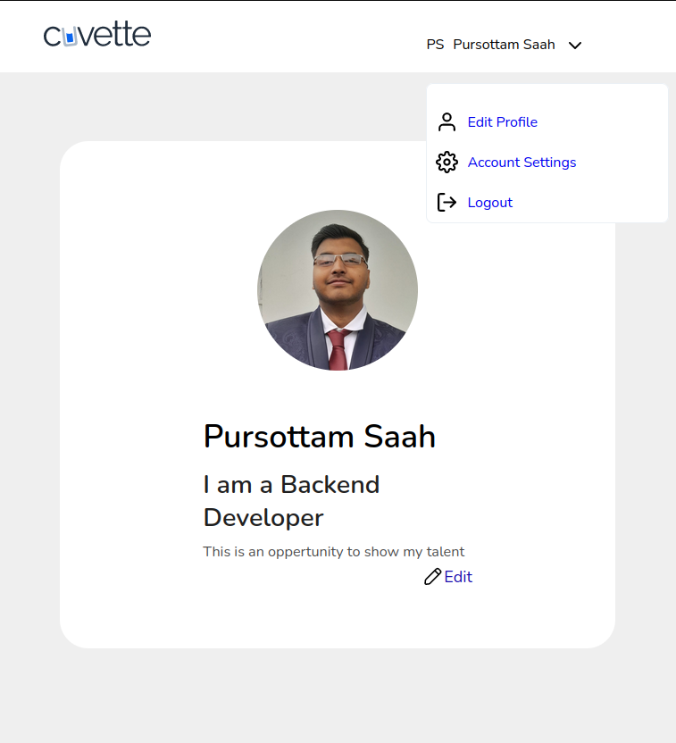

# Django User Authentication Web Application

This is a simple Django web application that implements user authentication features, including user registration (sign-up), login, basic user profile, and logout functionalities.
 




## Video Demo 
Google Drive Link : https://drive.google.com/drive/folders/1DIQGVTxOHa4Hxlm0yjx0amx_5QQWAkvS

#### Part 1 : https://drive.google.com/file/d/1G-f6qUOHZEtrH1Z0IfcCbzptvmeI1Np2/view?usp=sharing

#### Part 2: https://drive.google.com/file/d/12EBHE_qhtyzZa90TiwDTvwmJgjOakh-F/view?usp=sharing

## Objective

Create a Django web application to manage user authentication with features like registration, login, a user dashboard, user profile, and logout.

## Requirements

1. Use Django to create a new project and a single app.
2. Implement a user registration (sign-up) page with the following fields:
   - Username
   - Email
   - Password
   - Confirm Password
3. Implement a user login page with the following fields:
   - Username or Email
   - Password
4. After successful login, redirect the user to a simple dashboard page displaying a welcome message with their username.
5. Implement a basic user profile page that displays user information. Users should only access this page when logged in.
6. Implement a logout functionality that logs the user out and redirects them to the login page.
7. Use Django's built-in authentication system for handling user registration, login, and logout.

## Additional Notes

- Passwords are securely stored using Django's password hashing.
- Proper form validation is implemented to handle errors during registration and login.
- Django templates are used for rendering HTML pages.
- Basic styling is applied using CSS, and Bootstrap is used for a more polished look.
- A simple SQLite database is used to store user information.

## Project Structure

```
/cuvette_app
|-- routes
|   |-- migrations
|   |-- templates
|   |   |-- routes
|   |       |-- registration
|   |       |-- dashboard
|   |       |-- profile
|   |-- __init__.py
|   |-- admin.py
|   |-- apps.py
|   |-- decorators.py
|   |-- forms.py
|   |-- signals.py
|   |-- models.py
|   |-- tests.py
|   |-- urls.py
|   |-- views.py
|-- cuvette_app
|   |-- __init__.py
|   |-- settings.py
|   |-- urls.py
|   |-- asgi.py
|   |-- wsgi.py
|-- manage.py
|-- db.sqlite3
|-- README.md
|-- requirements.txt
|-- .gitignore
```
## Screenshorts 
* Login Page


* Sign up Page


* Profile Page


* Update profile page


* Final edit profile page

## Getting Started

1. Clone the repository:

   ```bash
   git clone https://github.com/your_username/cuvette_app.git
   ```

2. Install dependencies:

   ```bash
   pip install -r requirements.txt
   ```

3. Apply migrations:

   ```bash
   python manage.py migrate
   ```

4. Run the development server:

   ```bash
   python manage.py runserver
   ```
> Note It is recommended to use a virtual environment for this project.

To create virtual environment install conda 

```bash
conda create -n myenv python=3.10
```

To activate the environment

```bash
conda activate myenv
```

5. Open your browser and go to http://127.0.0.1:8000/ to access the application.

## Submission

1. Share your project's source code via a [GitHub repository](https://github.com/Pursottam6003/cuvette_app).
2. Submit a 3-4 minute video explaining the working of the app and a code walkthrough. You can use [Loom](https://www.loom.com/) or upload it to [YouTube](https://www.youtube.com/) or [Google Drive](https://drive.google.com/) and share the link.
3. Include the README.md file in the repository with instructions on how to set up and run the project.
4. Provide any additional information or comments you think are relevant.

## Resources
* Stackoverflow
* Django Documentation
* Bootstrap Documentation
